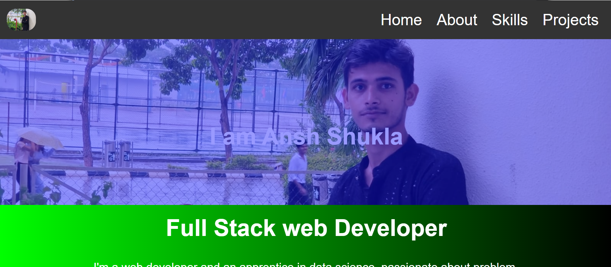

🖥️ My Portfolio
🚀 Live Demo: https://webansh.netlify.app/

📌 About the Project
This is my personal portfolio website, built using HTML, CSS, and JavaScript, to showcase my skills, projects, and experience as a Full Stack Web Developer.

🎨 Features
✔️ Responsive Design
✔️ Smooth Animations
✔️ About Me, Skills, and Projects Section
✔️ Contact Form

🚀 Deployment
The portfolio is deployed on Netlify for free hosting. Any updates can be pushed to the GitHub repo and Netlify will auto-update the site.

📬 Connect With Me
📧 Email: ansh_shukla@srmap.edu.in
🌍 Portfolio: https://webansh.netlify.app/